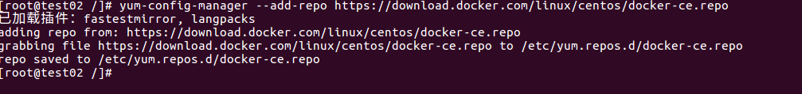
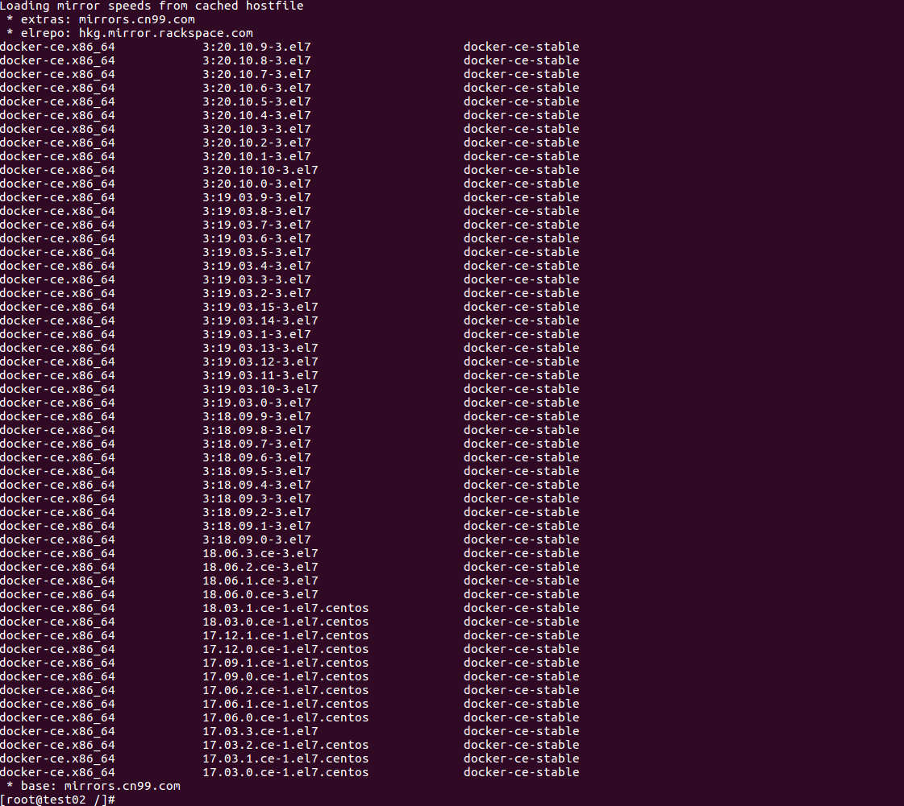
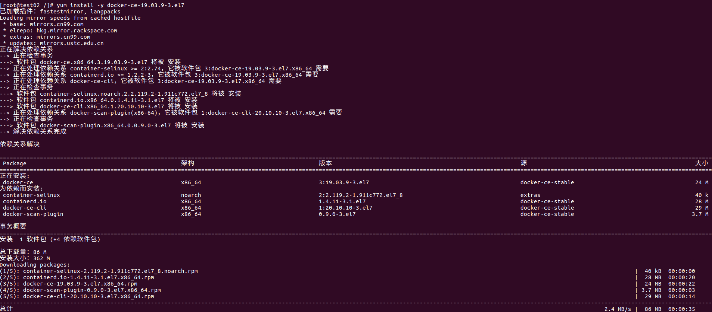
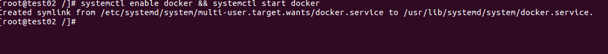
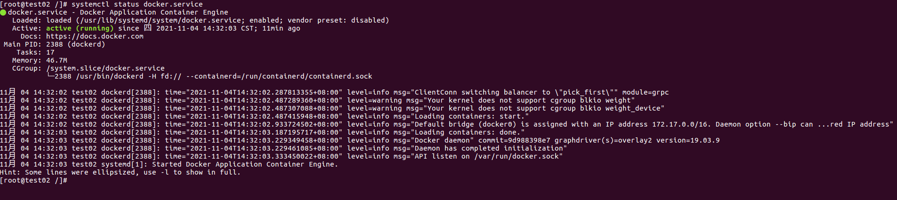
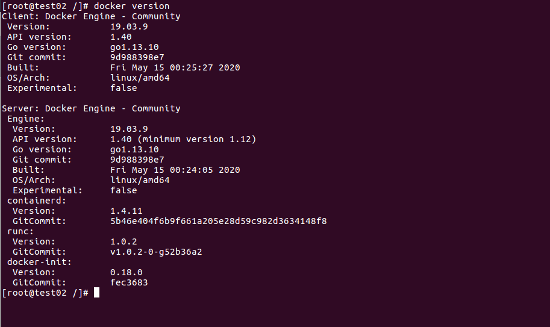
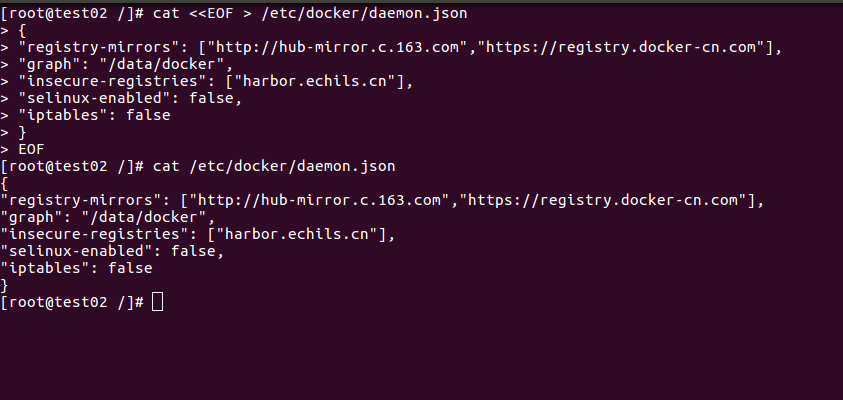
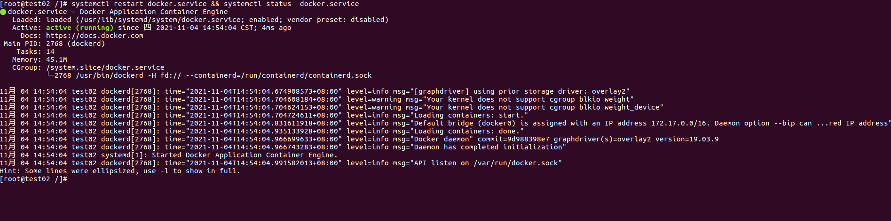

# 记录日常学习和工作中有关Docker的知识

  

## CentOS 7安装Docker
1、关闭防火墙

`systemctl stop firewalld && systemctl disable firewalld`

2、关闭SELINUX

`sed -i 's/SELINUX=enforcing/SELINUX=disabled/g' /etc/selinux/config`

3、安装工具

`yum install -y yum-utils device-mapper-persistent-data lvm2`

  

4、安装Docker源

`yum-config-manager --add-repo https://download.docker.com/linux/centos/docker-ce.repo`

  

5、查找并选择Docker安装版本

`yum list docker-ce --showduplicates | sort -r`

  

5、安装Docker(版本已19.03.9-3.el7为例)

`yum install -y docker-ce-19.03.9-3.el7 docker-ce-cli-19.03.9-3.el7 containerd.io`

  

6、配置Docker自启动

`systemctl enable docker && systemctl start docker`

  

7、验证安装是否成功

`systemctl status docker.service`

  

8、验证Docker版本

`docker version`

  

9、配置镜像加速和私服

`cat <<EOF > /etc/docker/daemon.json
 {
 "registry-mirrors": ["http://hub-mirror.c.163.com","https://registry.docker-cn.com"],
 "graph": "/data/docker",
 "insecure-registries": ["harbor.echils.cn"],
 "selinux-enabled": false,
 "iptables": false
 }
 EOF
`

  

10、重启Docker服务并验证Docker

`systemctl restart docker.service && systemctl status docker.service`

  

