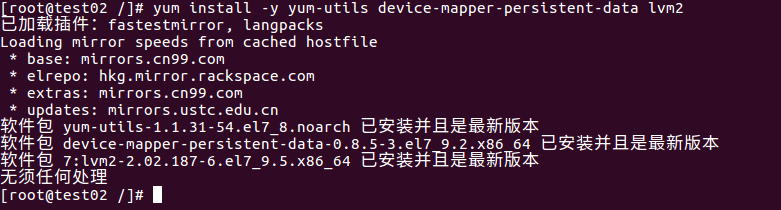

# 记录日常学习和工作中有关Docker的知识

  

- **[CentOS 7安装Docker](#jump1)**
- **[CentOS 7卸载Docker](#jump2)**
- **[Docker 基础知识点](#jump3)**

***

## CentOS 7安装Docker
**1、关闭防火墙**

`systemctl stop firewalld && systemctl disable firewalld`

**2、关闭SELINUX**

`sed -i 's/SELINUX=enforcing/SELINUX=disabled/g' /etc/selinux/config`

**3、安装工具**

`yum install -y yum-utils device-mapper-persistent-data lvm2`

  

**4、安装Docker源**

`yum-config-manager --add-repo https://download.docker.com/linux/centos/docker-ce.repo`

  

**5、查找并选择Docker安装版本**

`yum list docker-ce --showduplicates | sort -r`

  

**6、安装Docker(版本已19.03.9-3.el7为例)**

`yum install -y docker-ce-19.03.9-3.el7 docker-ce-cli-19.03.9-3.el7 containerd.io`

  

**7、配置Docker自启动**

`systemctl enable docker && systemctl start docker`

  

**8、验证安装是否成功**

`systemctl status docker.service`

  

**9、验证Docker版本**

`docker version`

  

**10、配置镜像加速和私服**

`cat <<EOF > /etc/docker/daemon.json
 {
 "registry-mirrors": ["http://hub-mirror.c.163.com","https://registry.docker-cn.com"],
 "graph": "/data/docker",
 "insecure-registries": ["harbor.echils.cn"],
 "selinux-enabled": false,
 "iptables": false
 }
 EOF
`

  

**11、重启Docker服务并验证Docker**

`systemctl restart docker.service && systemctl status docker.service`

  

***

## CentOS 7卸载Docker
**1、搜索并删除已安装的docker安装包**

`yum list installed|grep docker`

  

**2、删除docker组件**

`yum remove -y docker \
 docker-client \
 docker-client-latest \
 docker-common \
 docker-latest \
 docker-latest-logrotate \
 docker-logrotate \
 docker-selinux \
 docker-engine-selinux \
 docker-engine
`

  

**3、删除docker镜像、容器路径**

`rm -rf /var/lib/docker && rm -rf /data/docker`

注意: data/docker是上面安装时自定义的路径，没有配置的话只需要删除默认路径/var/lib/docker

**4、删除docker临时文件系统**

`rm -rf /var/run/docker`

## Docker 基础知识点

**1、Docker 核心组件**

`Docker的三大组件是指：镜像（Image）、容器（Container）、仓库（Repository）`

**2、Dockerfile 语法**

* FROM 用于指定依赖的基础镜像  
`FROM openjdk:8  #指定以OpenJDK8为基础镜像`
* MAINTAINER 用于描述该镜像的维护者信息  
`MAINTAINER echils echils@outlook.com`
* COPY 用于拷贝宿主机的源目录/文件到容器内的指定目录  
`COPY /home /data #将宿主机/home下的文件拷贝到容器目录/data下`
* ADD 功能和用法与COPY指令基本相同，不同在于使用ADD指令拷贝时，如果拷贝的是压缩文件，拷贝到容器中时会自动解压为目录  
`ADD jdk-8u202-linux-x64.tar.gz /data/java/ #将宿主机当前目录下的JDK拷贝到容器目录/data/java下并解压`
* WORKDIR 指定工作目录，也是RUN、CMD、ENTRYPOINT 指令执行时的当前目录   
`WORKDIR /home  #容器启动时切换到/home目录并且在当前目录执行初始命令`
* VOLUME 数据卷挂载   
  `VOLUME /home /data  #将宿主机/home目录挂载到容器/data目录`
* USER 指令设置运行镜像时要使用的用户名（或 UID）以及可选的用户组（或 GID）    
  `USER echils #以echils用户进行操作`
* ONBUILD 配置当所创建的镜像作为其它新创建镜像的基础镜像时，所执行的操作指令    
  `ONBUILD RUN mkdir /foo 当前镜像被作为基础进行时，执行创建/foo目录`
* ENV 用于设置环境变量，在容器内被脚本或者程序调用      
  `ENV JAVA_HOME /foo #配置JAVA_HOME`
* EXPOSE EXPOSE用来暴露端口      
  `EXPOSE 8080 #暴露8080端口`
* RUN 执行命令并创建新的镜像层，通常用于镜像构建过程中安装软件包，Dockerfile 中常常包含多个 RUN 指令      
  `RUN apt-get update && apt-get install -y #执行更新`
* CMD 指定容器的默认执行的命令，如果Dockerfile中如果存在多个CMD指令，仅最后一个生效。注意如果通过docker run 命令行参数中指定要运行的命令，那么Dockerfile中的默认命令将会覆盖      
  `CMD [“java”,"-jar","/helloworld.jar"] #默认启动启动helloworld程序`
* ENTRYPOINT 类似于 CMD 指令，但其不会被 docker run 的命令行参数指定的指令所覆盖，但是如果运行docker run时使用了 --entrypoint 选项，那么也会被覆盖，注意ENTRYPOINT中的参数始终会被使用；      
  `ENTRYPOINT ["java"] 
   CMD ["-jar","/helloworld.jar"]  #启动helloworld程序`

**3、Docker 常用命令**

* 创建镜像  `docker build [OPTIONS] PATH`  
  `docker build -t echils:1.0 /data #以/data目录下的Dockerfile构建一个echils:1.0的镜像`  
* 进入容器（退出时容器也退出）  `docker attach [CONTAINER_ID]`  
  `docker attach abcd  #进入容器abcd,退出时同时关闭容器`    
* 进入容器（退出时容器不退出）  `docker exec [OPTIONS] [CONTAINER_ID]`  
  `docker exec -it abcd /bin/bash  #进入容器abcd,退出时容器正常运行`  
* 依照容器创建一个新的镜像  `docker commit [OPTIONS] CONTAINER [REPOSITORY[:TAG]]`  
  `docker commit -a "echils" -m "2.0" abcd  echils:2.0  # 以容器abcd当前状态构建一个新的镜像echils:2.0,作者echils,描述为“2.0”`    
* 容器与主机之间的数据拷贝  `docker cp [OPTIONS] CONTAINER:SRC_PATH DEST_PATH`  
  `docker cp abcd:/data /home  #将容器abcd的/data目录拷贝到宿主机/home目录`   
  `docker cp /home abcd:/data  #将宿主机/home目录拷贝到容器abcd的/data目录`   
* 创建一个新的容器但不启动它 `docker create [OPTIONS] IMAGE [COMMAND]`  
  `docker create --name nginx nginx:latest  #创建一个nginx容器但不启动`   
* 创建一个新的容器 `docker run [OPTIONS] IMAGE [COMMAND] [ARG...]`  
  `docker run -p 80:80 -v /data:/data -d nginx:latest  #以后台模式启动一个nginx容器,将容器的 80 端口映射到主机的 80 端口,主机的目录 /data 映射到容器的 /data`  
* 导出容器 `docker export [OPTIONS] CONTAINER`  
  `docker export -o echils1.0.tar abcd #将容器abcd导出为镜像tar`   
* 导出镜像 `docker save [OPTIONS] IMAGE [IMAGE...]`  
  `docker save -o echils2.0.tar echils:2.0 #将镜像echils:2.0导出为镜像tar`  
* 导入使用 docker save 命令导出的镜像tar `docker load [OPTIONS]`   
  `docker load -i echils2.0.tar #导入镜像`  
* 导入使用 docker export 命令导出的镜像tar `docker import [file|URL] [REPOSITORY[:TAG]]`   
  `docker import -i echils1.0.tar echils:1.0 #导入镜像并命名为echils:1.0 `   
* 查看指定镜像的创建历史 `docker history [REPOSITORY[:TAG]]`  
  `docker history echils:2.0 #查看镜像echils:2.0构建历史`    
* 查看镜像列表 `docker images [OPTIONS]`  
  `docker images -aq #查看所有镜像ID`    
* 删除镜像 `docker rmi [OPTIONS] IMAGE [IMAGE...]`  
 `docker rmi -f echils:1.0 echils:2.0  #强制删除两个镜像`   
* 重命名镜像并加入仓库 `docker tag MAGE[:TAG] NEW_MAGE[:TAG]`  
  `docker tag echils:1.0 hub/echils:1.0  #重命名镜像echils:1.0`    
* 杀掉容器 `docker kill CONTAINER`  
  `docker kill abcd  #杀掉容器abcd`  
* 登录、登出仓库 `docker login/logout [OPTIONS] [SERVER]`  
  `docker login -u 用户名 -p 密码   # 登录Docker Hub`  
  `docker logout   # 登出Docker Hub`  
* 上传镜像 `docker push [OPTIONS] NAME[:TAG]`  
  `docker push echils:1.0   # 上传本地镜像echils:1.0到镜像仓库中。`   
* 查找镜像 `docker search [OPTIONS] TERM`  
  `docker search -f stars=100 nginx  #查找所有镜像名包含nginx，并且收藏数大于 100 的镜像`  
* 拉取镜像 `docker pull [REPOSITORY[:TAG]]`  
  `docker pull nginx  #拉取nginx最新镜像`  
* 查看容器列表 `docker ps [OPTIONS]`  
  `docker ps -a  #查看所有容器`  
* 删除容器 `docker rm [OPTIONS] CONTAINER`  
  `docker rm -f -v abcd  #强制删除容器abcd,并删除挂在卷`  
* 启动、停止、重启容器 `docker start/stop/restart CONTAINER`  
  `docker restart abcd  #重启容器abcd`  
* 暂停、恢复容器 `docker pause/unpause CONTAINER`  
  `docker pause abcd  #暂停容器abcd`  
* 查看容器/镜像的元数据 `docker inspect CONTAINER/[REPOSITORY[:TAG]]`  
  `docker inspect abcd  #查看容器abcd的元数据`  
* 查看容器日志 `docker logs [OPTIONS] CONTAINER`  
  `docker logs -f abcd  #查看容器abcd的日志`  
* 查看容器端口映射情况 `docker port [OPTIONS] CONTAINER`  
  `docker port abcd  #查看容器abcd的端口映射情况`  
* 重命名容器 `docker rename CONTAINER NEW_NAME`  
  `docker rename abcd qwer #将容器abcd名称改为qwer`  
* 查看容器资源使用情况 `docker stats CONTAINER `
  `docker stats qwer #查看容器qwer资源使用情况`  